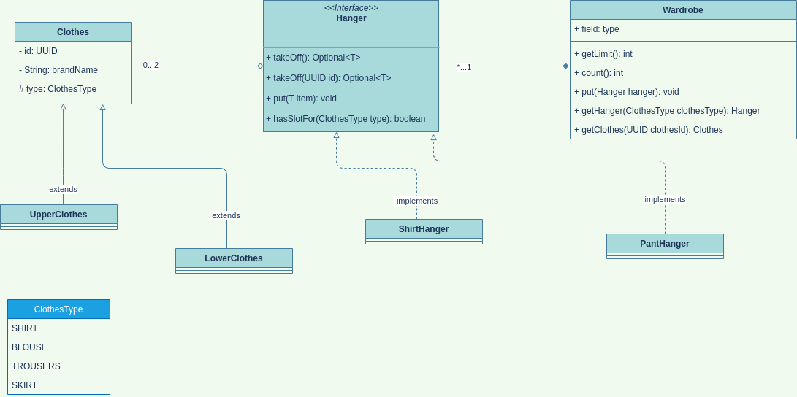

# Tech Interview Workbook

###### This is part of Codecool's curriculum Self Instructed Practice. It contains answers to questions from the "Programming Basics", "Web with Python" and "Java OOP" Modules.
***

1. ## [Programming Basics module](#Programming-Basics-Questions)
2. ## [Web with Python module](#Web-with-Python-Questions)
3. ## [Java OOP module](#OOP-Questions)
4. ## Advanced .NET C# module
***
<br/><br/>
<br/><br/>
<br/><br/>
# Programming Basics Questions

## Computer science

### Data structures

#### What is the purpose of a list (array in some programming languages) data structure? Name some methods of it!
* The purpose of a list is to collect objects in an orderly manner. 
* Some list methods are: _append()_, _extend()_, _insert()_, _remove()_, or _pop()_.
#### What is the difference between a list/array and a set?
* A list is ordered, can be accessed using an index, can have duplicate elements and are mutable (elements can be added,deleted, or moved around). 
* A set is unordered, its elements are unique and are immutable (they can't be changed once they have been assigned).
#### What is the purpose and methods of a dictionary/map data structure?
* The purpose of a dictionary is to map keys to values and store them in an array or collection. 
* The methods of a dictionary are: _items()_, _keys()_, _values()_, _get()_ and _popitem()_.
* * *

### Algorithms

#### Fibonacci sequences. Write a method (or pseudo code), that generates the Fibonacci sequences.
```
def fibonacci(n):
    terms = [0, 1]
    i = 2
    while i <= n:
        terms.append(terms[i - 1] + terms[i - 2])
        i += 1
    return terms
```
#### How do you find a max value in a list/array if you can’t use any built-in functions?
```
def max_in_list(listOfNr):
    maxi = -1.8e308
    for number in listOfNr:
        if maxi < number:
            maxi = number
    return maxi
```
#### How do you find the average of values in a list/array if you can’t use any built-in functions?
```
def find_avg(array):
    sum_of_values = 0
    for value in array:
        sum_of_values += value
    return sum_of_values / len(array)
```
#### What do we call an *in-place* sort?
* We call _sort()_ an in-place method because it modifies a given list in-place (it modifies the actual list on the spot without returning a new one) by using _<_ comparisons between items.
#### Explain an algorithm which sorts a list!
* Example of *Bubble Sort* algorithm:
```
finished = False                    # declare a boolean variable to check if we finished sorting the list
list_length = len(a_list)           # get the number of items in a list so that we don't call len() for each iteration
while not finished:                 # we keep looping until we finished sorting (finished == True)
    finished = True                 # we assume it's finished (the condition to break out of the while loop)
    for i in range(list_length - 1):               # iterate through the list without the last item
        if a_list[i] > a_list[i + 1]:              # if the current item is bigger than the next..
            a_list[i], a_list[i + 1] = a_list[i + 1], a_list[i]         # we swap them
            finished = False        # keep looping until we have nothing left to swap
```
* * *

### Programming paradigms - procedural

#### What is the call stack?
* The _call stack_ is a frame where Python stores information about functions which have been called. 
* Whenever a function is called, a new stack frame is added to the stack – all of the function’s parameters are added to it, and as the body of the function is executed, local variables will be created there.
* When the function finishes executing, its stack frame is discarded, and the flow of control returns to wherever you were before you called the function, at the previous level of the stack.
#### What is “Stack overflow”?
* _Stack overflow_ is a filled up stack frame. Python’s stack has a finite size – if we keep placing instances of the function on the stack we will eventually fill it up and cause a stack overflow.
#### What are the main parts of a function?
* The mai parts of a function are: _parameters_, _function body_, _variables_, _statements_, _expressions_, _function call_ and _arguments (input parameters)_.
* * *

### Programming languages - Python  
#### How do you use a dictionary in Python?
* We can use a dictionary to store key-value pairs. To define a dictionary literal, we put a comma-separated list of key-value pairs between curly brackets. We use a colon to separate each key from its value. We access values in the dictionary by using keys instead of indices.
#### What does it mean that an object is immutable in Python?
* _Immutable_ means we cannot alter the existing value in any way. Some values in Python can be modified, and some cannot. 
* Integers, floating-point numbers and strings are all immutable types. Tuples are immutable data types.
#### What is conditional expression in Python?
* A _conditional expression_ is a selection control statement that allows programmers to change the flow of control.
* Conditionals (the _if/elif/else_ family) can be used to pick a code block based upon the truth value of the conditions in them.
#### What are different types of arguments in Python?
* There are 3 types of arguments:
    1. _optional_ => To make a parameter optional, we need to supply a default value for it. Optional parameters must come after all the required parameters in the function definition:
    ```
    def make_greeting(title, name, surname, formal=True):
        if formal:
            return "Hello, %s %s!" % (title, surname)
        return "Hello, %s!" % name
    make_greeting("Mr", "John", "Smith")
    make_greeting("Mr", "John", "Smith", False)
    ```
    2. _positional_ => a tuple of values which are matched up with parameters in the function signature based on their positions:
    ```
    def make_greeting(title, name, surname, formal=True, time=None):
        if formal:
            fullname =  "%s %s" % (title, surname)
        else:
            fullname = name
        if time is None:
            greeting = "Hello"
        else:
            greeting = "Good %s" % time
        return "%s, %s!" % (greeting, fullname)
    make_greeting("Mr", "John", "Smith", False, "evening")
    ```
    3. _keyword_: => explicitly specify the parameter names along with the values:
    ```
    make_greeting(title="Mr", name="John", surname="Smith", formal=False, time="evening")
    ```
#### What is variable shadowing? (context: variable scope)
* _Variable shadowing_ occurs when a variable declared within a certain scope (decision block, method, or inner class) has the same name as a variable declared in an outer scope:
```
x = 0
def outer():
    x = 1
    def inner():
        x = 2
        print("inner:", x)
    inner()                # prints //inner: 2
    print("outer:", x) 
outer()                    # prints //outer: 1
print("global:", x)        # prints //global: 0
```
#### What can happen if you try to delete/drop/add an item from a List, while you are iterating over it in Python?
* You may encounter an IndexError: list index out of range.
#### What is the "golden rule" of variable scoping in Python (context: LEGB)? What is the lifetime of variables?
* The "golden rule" of variable scoping in Python (context: LEGB, L = Local, E = Enclosed (function is wrapped inside another function), G = Global, B =Built-in): when local as well as global variable is present, *preference is given to the local variable*. 
* The lifetime of a variable: it exists for as long as the function is executing. 
#### If you need to access the iterator variable after a for loop, how would you do it in Python?
* The built-in Python function _iter()_, which returns something called an iterator. The built-in function _next()_ is used to obtain the next value from in iterator:
```
a = ['foo', 'bar', 'baz']
itr = iter(a)
next(itr)
next(itr)
next(itr)
```
* If all the values from an iterator have been returned already, a subsequent next() call raises a StopIteration exception. 
#### What type of elements can a list contain in Python?
* A list can contain basically any type of elements.
#### What is slice operator in Python and how to use?
* The slice operator is a method that extracts a subset of a list, which will itself be a list.
* In order to use it, you need to specify an upper and lower bound. Note that our sublist will include the element at the lower bound, but _exclude_ the element at the upper bound:
```
animals = ['cat', 'dog', 'fish', 'bison']
print(animals[1:3]) # ['dog', 'fish']
print(animals[1:-1]) # ['dog', 'fish']
```
#### What arithmetic operators (+,*,-,/) can be used on lists in Python? What do they do?
* The arithmetic operators that can be used on lists are:
    - **+** addition
    - **-** subtraction
    - __*__ multiplication
    - **/** division
    - **%** modulo (the remainder of division)
    - __**__ exponentiation
#### What is the purpose of the in and not in membership operators in Python?
* Membership operators like _in_ and _not in_ are operators used to validate the membership of a value. It test for membership in a sequence, such as strings, lists, or tuples.
#### What does the + operator mean when used with strings in Python?
* When used with strings, the __+__ operator means concatenation: a method to add multiple strings together.
#### Explain f strings in Python?
* Python 3.6 added a new string formatting approach called formatted string literals or “f-strings”. This new way of formatting strings lets you use embedded Python expressions inside string constants:
```
>>> f'Hello, {name}!'
'Hello, Bob!'
```
#### Name 4 iterable types in Python!
* Lists, tuples, dictionaries and sets are all iterable types in Python. 
#### What is the difference between list/set/dictionary comprehension and a generator expression in Python?
* List Comprehension allows us to create a list using for loop with lesser code.
* The Generator Expression allows us to create a generator without the yield keyword. Instead of creating a list/set/dictionary and keeping the whole sequence in the memory, the generator generates the next element in demand.
```
list_comprehension = [i for i in range(11) if i % 2 == 0]
generator_expression = (i for i in range(11) if i % 2 == 0)
```
* The generator yields one item at a time and generates item only when in demand. Whereas, in a list/set/dictionary  comprehension, Python reserves memory for the whole list. Thus we can say that the generator expressions are memory efficient than the lists/set/dictionary comprehensions. Also generator expressions are faster than list/set/dictionary comprehensions and hence time efficient.
#### Does the order of the function definitions matter in Python? Why?
 * Yes, the order of the function definitions does matter in Python, because any call to a function must come after that function definition.
#### What does unpacking mean in Python?
* We can use * or ** when we are calling a function to _unpack_ a sequence or a dictionary into a series of individual parameters:
```
my_list = ["one", "two", "three"]
print_args(*my_list)
my_dict = {"name": "Jane", "surname": "Doe"}
print_kwargs(**my_dict)
```
#### What happens when you try to assign the result of a function which has no return statement to a variable in Python?
* A function without an explicit return statement returns _None_. The variable will have the value of _None_.
* * *

## Software engineering

### Debugging

#### What techniques can you use while debugging a program in Python?
* We can use the following techniques for debugging:
    + insert a _print()_ statement after every line which outputs the intermediate results which were calculated on that line.
    + an IDE debugger tool or the _pdb_, a built-in Python module which we can use to debug a program while it’s running.
    + some automated tools which can help us to debug errors: 
        - _Pyflakes_ parses code instead of importing it, which means that it can’t detect as many errors as other tools (but it is also safer to use, since there is no risk that it will execute broken code which does permanent damage to our system).
        - _Pylint_ and _PyChecker_ do import the code that they check, and they produce more extensive lists of errors and warnings.
        - _Pep8_ specifically targets bad coding style – it checks whether our code conforms to Pep 8, a specification document for good coding style.
#### What does step over, step into and step out mean while using the debugger?
* __*step into*__ A function is about to be invoked and you want to debug into the code of that function, so the next step is to go into that function and continue debugging step-by-step.
* __*step over*__ A function is about to be invoked, but you're not interested in debugging this particular invocation, so you want the debugger to execute that function completely as one entire step.
* __*step out*__ You're done debugging this function step-by-step and you just want the debugger to run the entire function until it returns as one entire step.
#### How can you start to debug a program from a certain line using the debugger?
* __*line breakpoint*__ You don't care how it got there, but if execution reaches a particular line of code, you want the debugger to temporarily pause execution there so you can decide what to do.
* * *

### Version control

#### What are the advantages of using a version control system?
- The primary benefits you should expect from version control are as follows:
    1. A complete long-term change history of every file (enables going back to previous versions to help in root cause analysis for bugs and it is crucial when needing to fix problems in older versions of software).
    2. Branching and merging. Individuals working on their own can benefit from the ability to work on independent streams of changes. There are many different workflows that teams can choose from when they decide how to make use of branching and merging facilities.
    3. Traceability. Version control software keeps track of every modification to the code in a special kind of database. If a mistake is made, developers can turn back the clock and compare earlier versions of the code to help fix the mistake while minimizing disruption to all team members.
#### What is the difference between the working directory, the staging area and the repository in git?
- Git has 3 areas:
    + The _working directory_ = contains the latest downloaded version from the repository together with any changes that have yet to be committed. As you're working on a project, all changes are made in this working directory.
    + The _staging area_  = helps to maintain this workflow by allowing you to only promote certain files at a time instead of all the changes in your working directory. Users move, otherwise referred to as promote, changes from the working directory, to a staging area before committing them into the repository.
    + The _repository_ = a virtual storage of your project. It allows you to save versions of your code, which you can access when needed.
#### What are remote repositories in git?
- Remote repositories are versions of your project that are hosted on the Internet or network somewhere. Collaborating with others involves managing these remote repositories and pushing and pulling data to and from them when you need to share work.
#### Why does a merge conflict occur?
- Merge conflicts happen when you merge branches that have competing commits, and Git needs your help to decide which changes to incorporate in the final merge.
#### Through what series of commands could you put a new file into a remote repository connected to your existing local repository?
- In Terminal, add the URL for the remote repository where your local repository will be pushed:
    + $ git remote add origin remote repository URL # Sets the new remote
    + $ git remote -v # Verifies the new remote URL
- Push the changes in your local repository to GitHub:
    + $ git push origin master # Pushes the changes in your local repository up to the remote repository you specified as the origin
#### What does it mean atomic commits and descriptive commit messages?
- When making code changes, you want to make commits that are generally smaller and that encompass only one irreducible feature, fix, or improvement.
#### What’s the difference between git and GitHub?
- Git is a version control system that lets you manage and keep track of your source code history.
- GitHub is a web-based hosting service that lets you manage Git repositories.  If you have open-source projects that use Git, then GitHub is designed to help you better manage them.
* * *

## Software design

### Clean code

#### What does clean code mean?
- Code is clean if it can be understood easily – by everyone on the team. Clean code can be read and enhanced by a developer other than its original author. With understandability comes readability, changeability, extensibility and maintainability.
#### What steps do we usually do during a clean code refactoring?
- Read through the whole code.
- Summarize what is the purpose of the script in one sentence.
- Run the code to see what is the end result.
- The code should keep runnable and show the same content when you finish the refactor.
- Run the code frequently to check you are on the right track.
- Actual refactoring:
    + Remove clutter: Clutter is anything in your code that does not add value
        * Format your code
        * Delete comments
    + Remove complexity:
        * bad names
        * long methods
        * deep conditionals
        * improper variable scopes (global, local)
    + Remove cleverness: If it's simple and elegant you wouldn't refer to it as 'clever'
    + Remove the 3 D's: duplication, duplication, duplication
        * his can be applied by extracting the duplicated code parts into functions
* * *

### Error handling

#### What is exception handling?
- _Exception handling_ is a method that handles unexpected errors in a Python program. Instead of letting the error crash our program we can intercept it, do something about it, and allow the program to continue.
- Errors are called exceptions in Python and all exceptions are subclasses of the Exception class.
#### What are the basics of exception handling in Python?
- The basics of _exception handling_ consist of _try-except_ blocks. Python will try to process all the statements inside the _try_ block. 
- If an error occurs at any point as it is executing them, the flow of control will immediately pass to the except block, and any remaining statements in the try block will be skipped.
>- It is good practice if the only code inside the try block is the single line that is the potential source of the error that we want to handle.
#### In which case should we catch an exception? Why?
- We should catch an exception when we want to protect small blocks of code against specific errors (better than to wrap large blocks of code and write vague, generic error recovery code).
- We catch exceptions because:
    + Exception handling separates normal code from code that handles errors.
    + Exceptions can easily be passed along functions in the stack until they reach a function which knows how to handle them. 
    + Exceptions come with lots of useful error information built in – for example, they can print a traceback which helps us to see exactly where the error occurred.
#### What can/should we do with an exception in the ‘except’ block?
- In the ‘except’ block we should write code that the program will execute when there is an exception.
- We can raise exceptions ourselves using the _raise_ statement - perhaps we may want to handle it partially in the current function, but also want to respond to it in the code which called the function.
- We can also write our own custom exception classes which are based on existing exception classes.
#### What does the else and finally statement do in a try-except block in Python?
- The _else_ statement will be executed only if the try clause doesn’t raise an exception.
- The _finally_ clause will be executed at the end of the try-except block no matter what – if there is no exception, if an exception is raised and handled, if an exception is raised and not handled, and even if we exit the block using *break*, *continue* or *return*. We can use the *finally* clause for cleanup code that we always want to be executed.
* * *

## Software Development Methodologies

#### What is the main goal of a retrospective meeting?
According to Agile software development:
>- A retrospective meeting is a meeting that's held at the end of a single development cycle, usually measured as one week or two. 
>- The main goal of the retrospective is to reflect on what happened in the development and identify actions for improvement and going forward.
>- Each member of the team members answers the following questions:
>    + What worked well for us?
>    + What did not work well for us?
>    + What actions can we take to improve our process going forward?
* * *

## Programming environment

### Unix

#### What is UNIX and what is Linux?
- UNIX is an operating system that was born in the late 1960s, when AT&T Bell Labs released an operating system called Unix written in C, which allows quicker modification, acceptance, and portability. It began as a one-man project under the leadership of Ken Thompson of Bell Labs. It went on to become most widely used operating systems. Unix is a proprietary operating system. Unix is a proprietary operating system.
- Linux is a replica of UNIX that does not use its code built by Linus Torvalds at the University of Helsinki in 1991. The name "Linux" comes from the Linux kernel. It is free and open source software.
#### What do we call the shell in Linux?
- Shell = command line interpreter
#### What does root means in a Linux environment?
- Root is the user name or account that by default has access to all commands and files on a Linux or other UNIX-like operating systems. It is also referred to as the root account, root user and the superuser.
#### How do you access your personal files in Linux?
- In Linux, personal data is stored in /home/username folder.
#### How can you install an application in Linux?
- Run the command in the Terminal (text input/output environment):
```
sudo apt install <name_of_application>
```
#### What is package management in Linux, what are repositories?
- Package management system allows users to install, update, remove and get information about software installed.
- Repositories are storage locations where the packages are downloaded from.
- Users can use _apt_ and _dpkg_ commands to query and update the database of software available in repositories and installed on the system, to install or remove software and upgrade installed packages, and clean up obsolete programs. 
#### How do you navigate in the filesystem with the command line?
- _cd_ Change directory. Used to navigate between folders.
- _pwd_ Display current directory.
- _ls_ Display a list of files in the current directory.
- _stat_ Display when a file was last accessed, modified, or changed.
#### What does the following commands do: mkdir, rm, cat, cp, touch?
- _mkdir_ Create a directory.
- _rm_ Remove a file or set of files.
- _cat_ Display the contents of a text file.
- _cp_ Makes a copy of a file.
- _touch_ Create a file.
#### How can you look up what does a command do in Linux if you have no internet connection?
- _command --help_ or _man command_
#### What does the following commands do: head, tail, more, less?
- _head_ Output the first 10 lines of file.
- _tail_ Output the last 10 lines of file.
- _more_ Output the contents of file.
- _less_ View and paginate file.
#### How do you download a file from internet using the terminal?
- _wget file_
* * *
* * *
<br/><br/>
<br/><br/>
<br/><br/>
# Web with Python Questions

## Software design

### Clean code

#### Point out 5 suggestions, how to format an SQL query!
1. Include the ***AS*** keyword for creating aliases: the first letter of each word in the object’s name
2. Use uppercase for the reserved keywords like ***SELECT*** and ***WHERE***.
3. Indentation: can really help the readability
4. Try to use only standard SQL functions
5. Only use letters, numbers and underscores in names.
#### What layers can you name in a simple web application?
* Presentation layer (UI layer, view layer, presentation tier)
* Business layer (business logic: determines how data can be created, stored, and changed. )
* Data access layer (persistence layer, logging, managing a database and other services which are required to support
 a particular business layer)
***

### Error handling
#### What error can occur, when an array does not have an element on the requested index?
* IndexOutOfRangeException
#### What is the “finally” block, and how would you use it?
* ***finally*** block is always executed after leaving the ***try*** statement
* ***finally*** block is used to deallocate the system resources.
#### Why should we catch special exception types?
* In Python, we use special exception types for control-flow, for pulling error-handling outside loops and can simplify
 code quite a bit in common situations where the ability to handle an issue is far removed from where the issue arose.
* The use of exceptions in Python does not slow the surrounding code and calling code.
***

### Security
#### What is SQL injection? How to protect an application against it?
* A SQL injection (SQLi) is a type of security exploit in which the attacker adds Structured Query Language (SQL) code
 to a Web form input box in order to gain access to unauthorized resources or make changes to sensitive data.
* The only sure way to prevent SQL Injection attacks is input validation and parametrized queries including prepared 
statements. The application code should never use the input directly. 
* The developer must sanitize all input, not only 
web form inputs such as login forms.
#### What is XSS? How to protect an application against it?
* Cross-Site Scripting (XSS) attacks are a type of injection, in which malicious scripts are injected into otherwise 
benign and trusted websites. XSS attacks occur when an attacker uses a web application to send malicious code, 
generally in the form of a browser side script, to a different end user.
* For example, the attacker could send the victim a misleading email with a link containing malicious JavaScript. If 
the victim clicks on the link, the HTTP request is initiated from the victim's browser and sent to the vulnerable web 
application.
* How to prevent XSS attacks: 
    * Filter input on arrival. At the point where user input is received, filter as strictly as possible based on what 
    is expected or valid input.
    * Encode data on output. At the point where user-controllable data is output in HTTP responses, encode the output 
    to prevent it from being interpreted as active content.
    * Use appropriate response headers. To prevent XSS in HTTP responses that aren't intended to contain any HTML or 
    JavaScript, you can use the Content-Type and X-Content-Type-Options headers to ensure that browsers interpret the 
    responses in the way you intend.
#### How to properly store passwords?
* The best way to protect passwords is to employ salted password hashing. 
* To Store a Password:
    1. Generate a long random salt using a CSPRNG.
    2. Prepend the salt to the password and hash it with a standard password hashing function like Argon2, bcrypt
    , scrypt, or PBKDF2.
    3. Save both the salt and the hash in the user's database record.
* To Validate a Password:
    1. Retrieve the user's salt and hash from the database.
    2. Prepend the salt to the given password and hash it using the same hash function.
    3. Compare the hash of the given password with the hash from the database. If they match, the password is correct. 
    Otherwise, the password is incorrect.
#### What is HTTPS?
* Hypertext Transfer Protocol Secure (HTTPS) is an extension of the Hypertext Transfer Protocol (HTTP). It is used for 
secure communication over a computer network, and is widely used on the Internet.
* HTTPS takes the HTTP protocol, and simply layers a SSL/TLS encryption layer on top of it. Servers and clients still 
speak exactly the same HTTP to each other, but over a secure SSL connection that encrypts and decrypts their requests 
and responses.
#### What is encryption and decryption?
* ***Encryption*** is the process of translating plain text data (plaintext) into something that appears to be random and 
meaningless (cipher text).
* ***Decryption*** is the process of converting cipher text back to plaintext.
#### What is hashing?
* A method of generating from a data collection a fixed length string.
#### What is the difference between encryption and hashing? When would you use which?
* Encryption is reversible, while hashing is one way.
#### What encryption methods do you know?
* Symmetric:
    * encrypter, and decrypter — need access to the same key.
    * make the key available only to the software that needs it.
* Asymmetric:
    * known as public key cryptography, uses public and private keys to encrypt and decrypt data.
    * Either of the keys can be used to encrypt a message; the opposite key from the one used to encrypt the message 
    is used for decryption.
* Hash:
    * used only to verify data
    * the same input will always produce the same output
    * impossible to reverse it back to the original data
#### What hashing methods do you know?
* SHA-1: This is the second version of the Secure Hash Algorithm standard, SHA-0 being the first. 
SHA-1 creates 160-bit outputs.
* SHA-2: This is actually a suite of hashing algorithms. The suite contains SHA-224, SHA-256, SHA-384, and SHA-512. 
Each algorithm is represented by the length of its output. SHA-2 algorithms are more secure than SHA-1 algorithms
#### How/where would you store sensitive data (like db password, API key, ...) of your application?
* Sensitive data should never be used or stored in non-production systems, and access passwords should be stored in a 
password manager rather than entrusted to individuals.
***

## Computer science

### Algorithms

#### What is the difference between Stack and Queue data structure?
* The main differences between stack and queue are that ***Stack*** uses LIFO (last in first out) method to access and
 add data elements whereas ***Queue*** uses FIFO (First in first out) method to access and add data elements.
#### What is BubbleSort? Describe the main logic of this sorting algorithm.
* A sorting algorithm that repeatedly steps through the list, compares adjacent elements and swaps them if 
they are in the wrong order. The pass through the list is repeated until the list is sorted.
#### Explain the process of finding the maximum and minimum value in a list of numbers!
* Declare two variables max and min to store maximum and minimum. Assume first array element as maximum and minimum 
both, say max = arr[0] and min = arr[0] . 
* Iterate through array to find maximum and minimum element in array.
#### Explain the process of calculating the average value in an array of numbers!
* Collect integer values in an array A of size N. Add all values of A. Divide the output with N. Display the
 output as average.
#### What is Big O complexity? Explain time and space complexity!
* Big O notation is used in Computer Science to describe the performance or complexity of an algorithm. 
* Big O specifically describes the worst-case scenario, and can be used to describe the execution time required or the 
space used (e.g. in memory or on disk) by an algorithm:
    * Different steps get added: 
        * O(a + b)
    * Drop constants: 
        * <del>O(2n)</del> &rarr; O(n)
    * Different inputs &rarr; different variables: 
        * <del>O(n<sup>2</sup>)</del> &rarr; O(a * b)
    * Drop non-dominate terms: 
        * <del>O(n + n<sup>2</sup>)</del> &rarr; O(n<sup>2</sup>)
#### Explain the process of calculating the average value in a linked list of numbers!
* Start traversing the linked list using a loop until all the nodes get traversed. Add the value of current node to 
the sum i.e. sum += ptr -> data. 
* Increment the pointer to the next node of linked list i.e. ptr = ptr ->next . Divide sum by total number of node 
and Return the average.
***

### Procedural
#### How the CASE condition works in SQL?
* CASE expression is the same as IF/ELSE statement in other programming languages:
```
SELECT name, continent, indep_year,
    CASE WHEN indep_year < 1900 THEN 'before 1900'
    WHEN indep_year <= 1930 THEN 'between 1900 and 1930'
    ELSE 'after 1930' 
    END AS indep_year_group
FROM countries
ORDER BY indep_year_group;
```
#### How the switch-case condition works in JavaScript?
```
let a = 2 + 2;
switch (a) {
  case 3:
    alert( 'Too small' );
    break;
  case 4:
    alert( 'Exactly!' );
    break;
  case 5:
    alert( 'Too large' );
    break;
  default:
    alert( "I don't know such values" );
}
```
#### How to achieve a switch-case-like structure in Python?
```
def week(i):
    switcher={
            0:'Sunday',
            1:'Monday',
            2:'Tuesday',
            3:'Wednesday',
            4:'Thursday',
            5:'Friday',
            6:'Saturday'
         }
    return switcher.get(i, "Invalid day of week")
```
#### Explain variable scoping in Python!
* A variable created inside a function is available inside that function
* The local variable can be accessed from a function within the function
* A variable created outside of a function is global and can be used by anyone
#### What’s the difference between const and var in JavaScript?
* var: The scope of a variable defined with the keyword “var” is limited to the “function” within which it is defined. 
If it is defined outside any function, the scope of the variable is global.
* var is “function scoped”.
* let: The scope of a variable defined with the keyword “let” or “const” is limited to the “block” defined by curly
 braces i.e. {}.
* “let” and “const” are“block scoped”.
* const: The scope of a variable defined with the keyword “const” is limited to the block defined by curly braces.
* “const” cannot be re-assigned to a new value.
* value of the variable defined within the "const" keyword is mutable
#### How the list comprehension looks like in Python?
```
new_list = [expression for member in iterable (if conditional)]
sentence = 'the rocket came back from mars'
vowels = [i for i in sentence if i in 'aeiou']
```
#### How the “ternary expression” looks like in Python?
```
a if a > b else b
'yes' if ('qux' in ['foo', 'bar', 'baz']) else 'no'
```
#### How the ternary expression looks like in JavaScript?
```
var age = 19;
var canDrive = age > 16 ? 'yes' : 'no';
```
#### How to import a function from another module in Python?
```
import mod
from mod import s, foo
```
#### How to import a function from another module in JavaScript?
```
models/course.js
export function Course() {
    this.id = '';
    this.name = '';
};
models/student.js
import { Course } from './course.js';
```
***

### Functional
#### What is recursion?
* Recursion is the process which comes into existence when a function calls a copy of itself to work on a smaller 
problem. Any function which calls itself is called recursive function, and such function calls are called recursive 
calls.
#### Write a recursive function which calculates the Fibonacci numbers!
```
def fib(n):
    if n < 0:
        return "Incorrect input"
    elif n == 1:
        return 0
    elif n == 2:
        return 1
    else:
        return fib(n - 1) + fib(n - 2)
def fib_seq(n):
    result = []
    for i in range(1, n + 1):
        temp = fib(i)
        result.append(temp)
    return result
```
#### How to store a function in a variable in Python?
```
def greet(name):
    def get_message():
        return "Hello "

    result = get_message() + name
    return result
```
#### List the ways of defining a callable logical unit in JavaScript!
* Function expression:
```
const square = function(number) { 
    return number * number 
}
```
* Function declaration:
```
function square(number) {
  return number * number;
}
```
* IIFE (Immediately Invoked Function Expression):
```
(function(number) { 
    return number * number 
})();
```
#### What is an event listener? How to attach one?
* A function that is called whenever an event of the specified type occurs:
```
const buttonElement = document.getElementById('btn');
buttonElement.addEventListener('click', function (event) {
  alert('Element clicked through function!');
});
```
#### How to trigger an event in JavaScript?
```
var el = document.querySelector('input[type="text"]');
el.click(); // for any element
el.focus(); // for inputs and textareas
el.blur();
var my_form = document.querySelector('form'); // for form elements
my_form.submit();
my_form.reset();
```
#### What is a callback function? Tell some examples of its usage.
* A ***callback function*** is a function passed into another function as an argument.
```
function greeting(name) {
  alert('Hello ' + name);
}
function processUserInput(callback) {
  var name = prompt('Please enter your name.');
  callback(name);
}
processUserInput(greeting);
```
#### What is a Python decorator? How does it work? Tell some examples of its usage.
* ***Decorators*** wrap functions, modifying the behavior of the code before and after a target function execution, 
without the need to modify the function itself:
```
def decorator(func):
    def func_wrapper(name):
        print("Wrapper function first part")
        print(func(name))
        print("Wrapper function last part")
    return func_wrapper
@decorator
def function_to_wrap(text_parameter):
   return "Wrapped function. Its parameter: " + text_parameter
```
#### What is the difference between synchronous and asynchronous execution?
* When you execute something synchronously, you wait for it to finish before moving on to another task. When you 
execute something asynchronously, you can move on to another task before it finishes.
***

## Programming languages

### SQL

#### How can you connect your application to a database server? What are the possible ways?
* In order to connect to the database, we create a connection to it. Any queries and operations are performed 
using the connection, which is closed after the work is finished.
* Use environment variables to save personal data, like database password, database name, host and user name.
#### When do you use the DISTINCT keyword in SQL?
* The SQL DISTINCT keyword is used in conjunction with the SELECT statement to eliminate all the duplicate records and 
fetching only unique records.
#### What are aggregate functions in SQL? Give 3 examples.
* Aggregate expressions (or functions) allow you to summarize information about a group of rows of data:
* i.e. ARRAY_AGG function is used to concatenate the input values including null into an array.
```
SELECT COUNT(*) FROM table WHERE name='Paul';
SELECT name, AVG(salary) FROM table GROUP BY name;
SELECT ARRAY_AGG(salary) FROM table;
```
#### What kind of JOIN types do you know in SQL? Could you give examples?
* INNER JOIN is a process that matches rows from the first table and the second table which have the same key (as 
defined by the ON constraint) to create a result row with the combined columns from both tables.
* When joining table A to table B, a LEFT JOIN includes rows from A regardless of whether a matching row is 
found in B.
* The RIGHT JOIN is similar, but reversed, keeping rows in B regardless of whether a match is found in A. 
* FULL OUTER JOIN means that rows from both tables are kept, regardless of whether a matching row exists in 
the other table.
#### What are the constraints in sql?
* Constraints are the rules enforced on data columns on table.
* Defining a data type for a column is a constraint in itself.
```
CREATE TABLE department1(
   id INT PRIMARY KEY      NOT NULL,
   dept           CHAR(50) NOT NULL,
   emp_id         INT      references company6(id)
);
```
#### What is a cursor in SQL? Why would you use one?
* The major function of a cursor is to retrieve data, one row at a time, from a result set, unlike the SQL commands
which operate on all the rows in the result set at one time.
* Cursors are used when the user needs to update records in a singleton fashion or in a row by row manner, in a
database table.
#### What are database indexes? When to use?
* Indexes are special lookup tables that the database search engine can use to speed up data retrieval.
* An index is a pointer to data in a table. An index in a database is very similar to an index in the back of a book.
* An index helps to speed up SELECT queries and WHERE clauses; however, it slows down data input, with UPDATE and
 INSERT statements. 
* Indexes can be created or dropped with no effect on the data.
#### What are database transactions? When to use?
* A transaction is a unit of work that is performed against a database.
* For example, if you are creating a record, updating a record, or deleting a record from the table, then you are 
performing transaction on the table.
*  It is important to control transactions to ensure data integrity and to handle database errors. Practically, you
 will club many SQL queries into a group and you will execute all of them together as a part of a transaction:
 ```
BEGIN;
...
COMMIT;
[ROLLBACK;]
```
#### What kind of database relations do you know? How to define them?
* There are three specific types of relationships that can exist between a pair of tables: 
    * one-to-one = when a single record in the first table is related to only one record in the second table, and a
    single record in the second table is related to only one record in the first table.
    * one-to-many = when a single record in the first table can be related to one or more records in the second table,
    but a single record in the second table can be related to only one record in the first table.
    * many-to-many = when a single record in the first table can be related to one or more records in the second table
    and a single record in the second table can be related to one or more records in the first table.
#### You have a table with an “address” field which contains data like “3525, Miskolc, Régiposta 9.” (postcode, city, street name and address). How would you query all records related to Miskolc?
```
SELECT * FROM table WHERE address LIKE '%Miskolc%';
```
#### How would you keep track of what kind of data has changed after an UPDATE or DELETE operation in a table?
* Call a stored procedure on your database server to write a log of the database changes.
* To track those changes made to tables in PostgreSQL you can write a generic changelog trigger.
***

### HTML & CSS

#### What’s the difference between XML, XHTML and HTML?
* XML is abbreviation for Extensible Markup Language whereas HTML stands for Hypertext Markup Language.
* XML is a markup language that defines a set of rules for encoding documents in a format that is both 
human-readable and machine-readable.
* XML is strict for closing tag while HTML is not strict. XML tags are extensible whereas HTML has limited tags.
* XML tags are not predefined whereas HTML has predefined tags.
* XHTML stands for EXtensible HyperText Markup Language and is a stricter, more XML-based version of HTML.
* XHTML is HTML defined as an XML application and is supported by all major browsers.
#### How to include a JavaScript file in a webpage?
* Internal:
```
<script>
    alert("Hello, world.");
</script>
```
* External:
```
<script src="script.js"></script>
```
#### How to include a CSS file in a webpage?
* Inline:
```
<p style="color: red">text</p>
```
* Internal:
```
<head>
    <title>CSS Example</title>
    <style>
        p {
            color: red;
        }
        a {
            color: blue;
        }
    </style>
</head>
```
* External (separate CSS file):
```
p {
    color: red;
}

a {
    color: blue;
}
```
#### How to select an element using its id in CSS?
```
#top {
    background-color: #ccc;
    padding: 20px
}
```
#### How to select elements using their class in CSS?
```
.intro {
    color: red;
    font-weight: bold;
}
```
#### How to select elements which have the ‘alpha’ and ‘beta’ classes in CSS?
```
.alpha.beta {
    color: red;
    font-weight: bold;
}
```
#### How to select all list items in all ordered lists on the page in CSS?
```
ol li {
    color: red;
    font-weight: bold;
}
```
#### How to select elements using their attributes in CSS?
```
input[type=text] { width: 200px; }
```
#### What are UX and UI?
* UX deals with the purpose and functionality of the product.
* UI deals with the quality of the interaction that the end-user has with the product.
* UI design has an artistic component as it relates to the design and interface with the product.
#### Please list some points that an application should fulfill to have good UX.
* Contrast - make the font bright not the background
* Font size
* Precise positioning
* Make it work with keyboard
* Cover all visual info with textual
#### What is XML, XSLT, DTD?
* XSLT (eXtensible Stylesheet Language Transformations) is the recommended style sheet language for XML. XSLT is far 
more sophisticated than CSS. 
* With XSLT you can add/remove elements and attributes to or from the output file.
* A document type definition (DTD) is a set of markup declarations that define a document type for an SGML-family 
markup language (GML, SGML, XML, HTML).
* The purpose of a DTD (Document Type Definition) is to define the legal building blocks of an XML document
#### What is the difference between HTML and XML?
* Hypertext Markup Language (HTML) is the standard markup language for documents designed to be displayed in a 
web browser.
* XML stands for Extensible Markup Language. It is a text-based markup language derived from Standard Generalized 
Markup Language (SGML).
* HTML is used for the data presentation whereas the main purpose of XML was to store and transfer the data.
* HTML is a simple, predefined language while XML is the standard markup language to define other languages. 
***

### Javascript

#### What is javascript?
* JavaScript is a lightweight, interpreted programming language. It is designed for creating network-centric 
applications.
* It is easy to implement because it is integrated with HTML. It is open and cross-platform.
* While it is most well-known as the scripting language for Web pages, many non-browser environments also use it, 
such as Node.js, Apache CouchDB and Adobe Acrobat.
#### When to use AJAX? Bring examples of its usage.
* AJAX = Asynchronous JavaScript and XML. AJAX is a technique for creating fast and dynamic web pages. 
* AJAX allows web pages to be updated asynchronously by exchanging small amounts of data with the server behind the 
scenes.
* Almost all sites that pull in new content without a page reload (like Facebook, Gmail, Google Maps etc) use this 
same technique:
```
async function getUsersAsync(count) {
    let response = await fetch(`https://randomuser.me/api/?results=${count}`);
    let data = await response.json()
    let results = data.results;
    for (let result of results) {
        list.innerHTML += populateCard(result);
    }
}
getUsersAsync(5);
```
#### What is DOM and how to manipulate it from Javascript?
* DOM is the Document Object Model. It is the API in HTML and XML document.
* JavaScript Methods For DOM Manipulation:
    * querySelector() The querySelector() method returns the first element that matches one or more CSS selectors
    * querySelectorAll()
    * addEventListener()
    * removeEventListener()
    * createElement()
    * appendChild()
    * removeChild()
    * replaceChild()
    * cloneNode() When you have to create a new element that needs to be the same as an already existing element on 
    the web page
    * insertBefore() method adds a specified child element before another child element. 
    * createDocumentFragment() method insert multiple elements in bulk, such as adding multiple rows to a table.
    * getComputedStyle() returns the read-only computed values of all the CSS properties of a specified HTML element.
    * setAttribute()
    * getAttribute() 
    * removeAttribute()
#### What are events and how/why to use them in Javascript?
* JavaScript's interaction with HTML is handled through events that occur when the user or the browser manipulates 
a page.
* When the page loads, it is called an event. When the user clicks a button, that click too is an event. Other 
examples include events like pressing any key, closing a window, resizing a window, etc.
* Events are a part of the Document Object Model (DOM) Level 3 and every HTML element contains a set of events 
which can trigger JavaScript Code.
* These events are used to execute JavaScript coded responses, which cause buttons to close windows, 
messages to be displayed to users, data to be validated, and virtually any other type of response imaginable.
#### What is event bubbling/capturing? How would you use it?
* Event bubbling and capturing are two ways of event propagation in the HTML DOM API, when an event occurs in an 
element inside another element, and both elements have registered a handle for that event.
* bubbling = the event is first captured and handled by the innermost element and then propagated to outer elements.
* capturing = the event is first captured by the outermost element and propagated to the inner elements.
* We can use the ***addEventListener(type, listener, useCapture)*** to register event handlers for in either 
bubbling (default, useCapture=false) or capturing mode.
* To use the capturing model pass the third argument as true.
#### What is JSON and how do we use it?
* JSON is JavaScript Object Notation = format is often used for serializing and transmitting structured data over 
a network connection.
* It is used primarily to transmit data between a server and web application, serving as an alternative to XML. 
***

## Software engineering

### Version control

#### What type of branching strategy would you use?
1. Centralized Workflow:
    * uses a central repository to serve as the single point-of-entry for all changes to the project.
    * the default development branch is called master and all changes are committed into this branch.
    *  This workflow doesn’t require any other branches besides master.
2. Feature branching:
    * all feature development should take place in a dedicated branch instead of the master branch.
    * the master branch should never contain broken code.
3. Forking Workflow:
    * gives every developer a server-side repository.
    * each contributor has not one, but two Git repositories: a private local one and a public server-side one.
    *  does not use a single server-side repository to act as the “central” codebase.
#### What would you do if you find a bug on the production code (master branch)?
* Create a hotfix branch from your "production" commit, fix bug, and merge it to master and develop.
#### How can you move changes from one branch to another in GIT?
* You can create a new branch pointing to the current commit using "git branch branchname"
(or "git checkout -b branchname" if you want to check it out directly).
* This will basically duplicate your master branch, so you can continue working on there.
#### How does a VCS help with code reviews?
* Because VCS keeps track of:
    * a complete long-term change history of every file. This means every change made by many individuals over time. 
    * the ability to work on independent streams of changes.
    * each change made to the software and connects it to project management and bug tracking software such as 
    Jira, and being able to annotate each change with a message describing the purpose and intent of the change
#### What is your favorite git command? Why?
```
git log --graph --decorate --oneline
```
* It will draw a text based graph of the commits on the left hand side of the commit messages, with the names of
 branches or tags of the commits on a single line.
#### What does remote/local mean in Git?
* ***git remote*** = lists the remote connections you have to other repositories.
* ***git remote -v*** = same including the URL of each connection.
* ***git remote add \<name> \<url>*** = create a new connection to a remote repository. 
* ***git remote rm \<name>*** = remove the connection to the remote repository called <name>.
***

### DevOps

#### Why is it good to use a package manager software?
* A package manager software is a programming language’s tool to create project environments and easily import external 
dependencies.
* ***pip*** allows you to add dependencies to your projects for your given Python instalments.
#### Why is it good to use a virtual environment for a project?
* ***virtualenv*** is a tool to create isolated Python environments. It solves a very specific problem: it allows
 multiple Python projects that have different (and often conflicting ) requirements, to coexist on the same computer.
***

### Networks

#### What kind of HTTP status codes do you know?
* 1xx Informational
    * Request received, continuing process.
* 2xx Success
    * action requested by the client was received, understood, accepted and processed successfully.
* 3xx Redirection
    * client must take additional action to complete the request.
* 4xx Client Error
    * client seems to have erred.
* 5xx Server Error
    * server failed to fulfill an apparently valid request.
#### What is a API?
* is a gate (interface) in a software, that allows connectivity for the outside word. Usually one API endpoint lets 
you interact with one certain part of the given software.
#### What is REST API?
* Representational state transfer (REST) or RESTful is an architectural style used for web development, aiming for fast
 performance, reliability and the ability to scale (to grow and easily support extra users). 
* RESTful API ensures other developers can understand the structure easily compared to creating endpoints without a
 standard.
#### What is JSON? When to use?
* JSON or JavaScript Object Notation is a lightweight text-based open standard designed for human-readable data
 interchange. 
* JSON format is used for serializing and transmitting structured data over network connection.
* It is primarily used to transmit data between a server and web applications.
* Web services and APIs use JSON format to provide public data.
#### What is TCP/IP? What layers does it define, what are they responsible for?
* The Internet works by using a protocol called TCP/IP, or Transmission Control Protocol/Internet Protocol.
* TCP/IP allows one computer to talk to another computer via the Internet through compiling packets of data and
 sending them to right location.
* TCP/IP model is practical model and is used in the Internet, which combines the two layers (Physical and Data link
 layer) into one layer i.e. Host-to-Network layer:
    * ***Application Layer***
        * provides different services such as manipulation of information, retransferring the files
         of information, distributing the results etc.
        * functions such as LOGIN or password checking are also performed by the application layer.
        * Protocols used in this layer: TELNET, FTP, SMTP, DN, HTTP, NNTP 
    * ***Transport Layer***
        * uses TCP and UDP protocols for end to end transmission.
        * TCP is reliable and connection oriented protocol, that also handles flow control.
    * ***Internet Layer***
        * allows the host to insert packets into network and then make them travel independently to the destination.
        * the order of receiving the packet can be different from the sequence they were sent.
        * Protocols used in this layer: Internet Protocol (IP).
    * ***Host-to-Network Layer***
        * the host has to connect to network using some protocol, so that it can send IP packets over it.
        * Protocols used in this layer: ARPANET, SATNET, LAN, packet radio
#### What’s the difference between TCP and UDP?
* User Datagram Protocol is used for broadcast and multicast type of network transmission.
* UDP protocol works almost similar to TCP, but it throws all the error-checking out.
* TCP is a connection-oriented protocol, whereas UDP is a connectionless protocol.
* TCP reads data as streams of bytes, and the message is transmitted to segment boundaries. TCP rearranges data
 packets in the specific order.
* UDP messages contain packets that were sent one by one. It also checks for integrity at the arrival time. UDP
 protocol has no fixed order because all packets are independent of each other.
* The speed for TCP is slower while the speed of UDP is faster.
*  UDP is used if both client and server may separately send packets, and occasional delay is also not acceptable. (e.g
. multiplayer games).
#### How does an HTTP Request look like? What are the most relevant HTTP header fields?
* HTTP header fields provide required information about the request or response, or about the object sent in the
  message body. There are four types of HTTP message headers:
    * _General-header_: These header fields have general applicability for both request and response messages.
        * Connection
    * _Client Request-header_: These header fields have applicability only for request messages.
        * Accept-Language
        * Accept-Encoding
    * _Server Response-header_: These header fields have applicability only for response messages.
        * Location : absoluteURI
        * Set-Cookie: NAME=VALUE; OPTIONS
    * _Entity-header_: These header fields define meta information about the entity-body or, if no body is present
    , about the resource identified by the request.
        * Allow: GET, HEAD, PUT, POST
        * Content-Length
        * Content-Type
* ***GET*** request
```
GET /hello.htm HTTP/1.1
User-Agent: Mozilla/4.0 (compatible; MSIE5.01; Windows NT)
Host: www.tutorialspoint.com

Accept-Language: en-us
Accept-Encoding: gzip, deflate
Connection: Keep-Alive
```
* ***POST*** request
```
POST /cgi-bin/process.cgi HTTP/1.1
User-Agent: Mozilla/4.0 (compatible; MSIE5.01; Windows NT)
Host: www.tutorialspoint.com

Content-Type: application/x-www-form-urlencoded
Content-Length: length

Accept-Language: en-us
Accept-Encoding: gzip, deflate
Connection: Keep-Alive

licenseID=string&content=string&/paramsXML=string
```
#### How does an HTTP Response look like? What are the most relevant HTTP header fields?
* The request method indicates the method to be performed on the resource identified by the given Request-URI. 
* Most relevant request methods:
    * GET method is used to retrieve information from the given server using a given URI. Requests using GET
     should only retrieve data and should have no other effect on the data.
     * 	POST request is used to send data to the server, for example, customer information, file upload, etc
     . using HTML forms.
     * 	PUT Replaces all the current representations of the target resource with the uploaded content.
     * DELETE Removes all the current representations of the target resource given by URI.
* HTTP Response example:
```
HTTP/1.1 200 OK
Date: Mon, 27 Jul 2009 12:28:53 GMT
Server: Apache/2.2.14 (Win32)
Last-Modified: Wed, 22 Jul 2009 19:15:56 GMT
Content-Length: 88
Content-Type: text/html
Connection: Closed
```
#### What is DNS? How does it work?
* DNS (Domain Name Server) is a host name to IP address translation service. It is a distributed database
 implemented in a hierarchy of name servers. It is an application layer protocol for message exchange between clients
  and servers.
* Domain name system comprises of: 
    * Domain Name
        * a symbolic string associated with an IP address. 
        * there are several domain names available; some of them are generic such as com, edu, gov, net etc,
        * some country level domain names such as au, in, za, us etc.
    * Domain Name Space
        * refers a hierarchy in the internet naming structure, which has multiple levels (from 0 to 127), with a 
        root at the top: edu &rarr; colorado &rarr; cs &rarr; kim
        * each domain can be partitioned into sub domains and these can be further partitioned and so on.
    * Name Server
        * contains the DNS database, that comprises of various names and their corresponding IP addresses. 
        * it is not possible for a single server to maintain entire DNS database, the information is distributed
         among many DNS servers.
        * The entire name space is divided into the zones
    * Zones
        * a collection of nodes (sub domains) under the main domain. The server maintains a database called zone file
         for every zone.
#### What is a web server?
* It is a computer where the web content is stored. Basically web server is used to host the web sites but there exists
 other web servers also such as gaming, storage, FTP, email etc.
#### Explain the client-server architecture.
* works with a system of request and response. The client sends a request to the server and the server responds with
  the desired information.
* The client and server follow a common communication protocol so they can easily interact with each other. All the
 communication protocols are available at the application layer.
* A server can only accommodate a limited number of client requests at a time. So it uses a system based to priority
  to respond to the requests.
* A web server is a client server computing system. It returns the web pages to the clients that requested them.
#### What would you use a session for?
* A session creates a file in a temporary directory on the server where registered session variables and their
  values are stored. This data will be available to all pages on the site during that visit.
* A session ends when the user closes the browser or after leaving the site, the server will terminate the session
  after a predetermined period of time, commonly 30 minutes duration.
#### What would you use a cookie for?
* Cookies are text files stored on the client computer and they are kept for tracking purposes. Server script
  sends a set of cookies to the browser.
* For example name, age, or identification number etc. The browser stores this information on a local machine for
 future use.
* When next time browser sends any request to web server then it sends those cookies information to the server and
  server uses that information to identify the user.
***

## Software Development Methodologies

#### What kind of software development methodologies do you know? What are the main features of these?
* ***Waterfall Model***
    * Requirement Gathering and analysis
    * System Design
    * Implementation
    * Integration and Testing
    * Deployment of system
    * Maintenance
* ***Agile Model***
    * User Stories &rarr; features customers might one day like to see in their software.
    * Estimation &rarr; make some really accurate predictions about the future while based on what was done in the past.
    * Iterations &rarr; a short one to two week period where a team takes a couple of their customers most important
     user stories and builds them completely as running-tested-software.
    * Planning &rarr; measuring the speed a team can turn user stories into working, production-ready software and
      then using that to figure out when they’ll be done.
    * Unit Testing &rarr; snippets of test code developers write to prove to themselves that what they are developing
     actually works.
    * Refactoring &rarr; maintaining order in the design
    * Burndown Charts &rarr; a chart that shows how quickly the customer's user stories are burned. It shows the total
     effort against the amount of work delivered for each iteration.
#### What are the SCRUM roles?
* Scrum is an efficient framework within which you can develop software with teamwork. It is based on agile principles.
* The Scrum Team consists of three roles, namely a ScrumMaster, a Product Owner, and the Team:
    * ScrumMaster &rarr; the keeper of the scrum process. He/she is responsible for:
        * making the process run smoothly
        * removing obstacles that impact productivity
        * organizing and facilitating the critical meetings
    * Product Owner &rarr; is the sole person responsible for managing the Product Backlog. Product Backlog
     management includes:
        * Expressing Product Backlog items clearly.
        * Ordering the Product Backlog items to best achieve goals and missions.
        * Optimizing the value of the work the Team performs.
        * Ensuring that the Product Backlog is visible, transparent, and clear to all, and shows what the Team will
         work on further.
         * Ensuring that the Team understands items in the Product Backlog to the level needed.
     * The Team &rarr; comprises of analysts, designers, developers, testers, etc. as appropriate and as relevant to
      the project.
        * The Team size should be kept in the range from five to nine people, if possible.
#### What are the SCRUM ceremonies?
* Sprint Planning Meeting &rarr; discuss and estimate the high priority user stories, and forecast the work which
  can be consummate in the current sprint.
* Daily Stand-up Meeting &rarr; enhances the team communications, increases visibility of the work, allows quick
 decisions making abilities, identifying and removing the obstacles.
* Sprint Review Meeting &rarr; also called as Demo or Showcase meeting held at the end of the sprint to demonstrate
  the actual working software to review and get the feedback.
* Sprint Retrospective Meeting &rarr; collect the feedback on how the team worked in the just concluded sprint. And
  based on those input the team identify the improvements for the next sprints.
#### What are the SCRUM artifacts?
* Scrum Artifacts provide key information that the Scrum Team and the stakeholders need to be aware of for
  understanding the product under development, the activities done, and the activities being planned in the project:
    * Product Backlog &rarr; list of items that have the attributes of a description, order, estimate, and value. These
     items are normally termed as User Stories.
    * Sprint Backlog &rarr; set of Product Backlog items selected for the Sprint, plus a plan for delivering the
     product Increment and realizing the Sprint Goal.
    * Increment &rarr; the sum of all the Product Backlog items completed during a Sprint combined with the
      increments of all previous Sprints.
    * Sprint Burn-Down Chart &rarr; the total work remaining in the Sprint Backlog.
#### What is the main goal of a retrospective meeting?
*  A lesson learned discussions to improve the way of work for the betterment of the team and the project.
#### Explain, when would you recommend to use the waterfall methodology?
* Waterfall methodology is recommended when:
    * Requirements are very clear and fixed. 
    * There are no ambiguous requirements. 
    * Ample resources with required expertise are available freely. 
    * The client has high confidence in the organization.
***
***
<br/><br/>
<br/><br/>
<br/><br/>
# OOP Questions

## Software design

### Error handling

#### What does 'fail fast' mean in terms of exception handling? Why is it a good practice?
* In systems design, a **_fail-fast_** system is one which immediately reports at its interface any condition that is
 likely to indicate a failure. 
* **_Fail-fast_** systems are usually designed to stop normal operation rather than attempt to continue a possibly flawed
 process.
* The **_fail fast_** principle stands for stopping the current operation as soon as any unexpected error occurs.
* Adhering to this principle generally results in a more stable solution.
*** 

## Computer Science

### Data structures

#### How to find the middle element of singly linked list in O(n)?
* Traverse linked list using two pointers. 
* Move one pointer by one and other pointer by two. 
* When the fast pointer reaches end slow pointer will reach middle
 of the linked list.
```java
// Java program to find middle of linked list 
class LinkedList 
{ 
    Node head; // head of linked list 
  
    /* Linked list node */
    class Node 
    { 
        int data; 
        Node next; 
        Node(int d) 
        { 
            data = d; 
            next = null; 
        } 
    } 
  
    /* Function to print middle of linked list */
    void printMiddle() 
    { 
        Node slow_ptr = head; 
        Node fast_ptr = head; 
        if (head != null) 
        { 
            while (fast_ptr != null && fast_ptr.next != null) 
            { 
                fast_ptr = fast_ptr.next.next; 
                slow_ptr = slow_ptr.next; 
            } 
            System.out.println("The middle element is [" + 
                                slow_ptr.data + "] \n"); 
        } 
    } 
}
```

#### Given an array of integers going from 1 to 100 (both inclusive) there is a duplicated entry. How to find it?
1. Declare and initialize an array.
2. Duplicate elements can be found using two loops. 
3. The outer loop will iterate through the array from 0 to length of
 the array. The outer loop will select an element. 
4. The inner loop will be used to compare the selected element with the rest of the elements of the array.
5. If a match is found which means the duplicate element is found then, display the element.
```java
public class DuplicateElement {  
    public static void main(String[] args) {
        System.out.println("Duplicate elements in given array: ");  
        //Searches for duplicate element  
        for(int i = 0; i < arr.length; i++) {  
            for(int j = i + 1; j < arr.length; j++) {  
                if(arr[i] == arr[j])  
                    System.out.println(arr[j]);  
            }  
        }  
    }  
}  
```

#### What is a linked list? How to find if a linked list has a loop?
1. **_Linked List_** is a part of the Collection framework present in _java.util_ package. 
2. This class is an implementation of the LinkedList data structure which is a linear data structure where the elements
 are not stored in contiguous locations and every element is a separate object with a data part and address part.
3. The elements are linked using pointers and addresses. Each element is known as a __node__.
4. The nodes cannot be accessed directly instead we need to start from the head and follow through the link to reach
 to a node we wish to access.
5. Advantages of **_Linked List_**:
    * Insertion and Deletion Operations are Easier.
    * Efficient Memory Utilization, i.e. no need to pre-allocate memory.
    * Faster Access time,can be expanded in constant time without memory overhead.
* To find if a linked list has a loop:
    * Have two references to the list and move them at different speeds.
    * If the linked list has a loop they will definitely meet.
    * Else either of the two references(or their next) will become null.
```java
public class LinkedList {
    boolean hasLoop(Node first) {
    
        if(first == null) // list does not exist..so no loop either
            return false;
    
        Node slow, fast; // create two references.
    
        slow = fast = first; // make both refer to the start of the list
    
        while(true) {
    
            slow = slow.next;          // 1 hop
    
            if(fast.next != null)
                fast = fast.next.next; // 2 hops
            else
                return false;          // next node null => no loop
    
            if(slow == null || fast == null) // if either hits null..no loop
                return false;
    
            if(slow == fast) // if the two ever meet...we must have a loop
                return true;
        }
    }
}
```

#### What is the Big O time complexity of the common operations in an ArrayList, LinkedList, HashMap? And of a bubble sort, quicksort, finding items in a Binary Search tree?
* ArrayList has O(n) time complexity for arbitrary indices of add/remove, but O(1) for the operation at the end of the list. 
* LinkedList has O(n) time complexity for arbitrary indices of add/remove, but O(1) for operations at end/beginning of
 the List.
* Hashmap has O(1) time complexity for both get and put operation.
* A Binary Search Tree data structure, first creates a binary search tree from the elements of the input list or
 array and then performs an in-order traversal on the created binary search tree to get the elements in sorted order.
* Average Case Time Complexity in a Binary Search Tree O(n log n).

#### How does HashMap work?
* HashMap implementation is based on the the principles of a hashtable: key-value pairs are stored in what is known as
 buckets which together make up what is called a table, which is actually an internal array.
* When a value is added to the map under a key, the hashCode() API of the key object is called to retrieve what is
 known as the initial hash value.
* Next, the hash() API of the hash map is called internally to compute the final hash value using the initial hash value.
* This final hash value ultimately boils down to an index in the internal array or what we call a bucket location.

#### Why is it important for keys in a map to have an immutable type? (Consider String for example.)
* If immutable, the object's hashcode wont change and it allows caching the hashcode of different keys which makes
 the overall retrieval process very fast.
* Since Strings are very popular as HashMap key, it's important for them to be immutable so that they can retrieve
 the value object which was stored in HashMap.
***

### Other

#### What is a garbage collector, in a nutshell?
* The garbage collector, or just collector, attempts to reclaim garbage, or memory occupied by objects that are no
 longer in use by the program. 
* In Java, as long as an object is being referenced, the JVM considers it alive. Once an object is no longer referenced
 and therefore is not reachable by the application code, the garbage collector removes it and reclaims the unused memory.
***

## Programming paradigms

### Procedural

#### What is casting? What is the difference between up vs downcasting?
* Casting is the process of making a variable behaves as a variable of another type.
* Casting from a subclass to a superclass is called upcasting. Typically, the upcasting is implicitly performed by
 the compiler.
* Downcasting is casting from a superclass to a subclass.
```java
// Parent class 
class Parent { 
	String name; 
	// A method which prints the signature of the parent class 
	void method() { System.out.println("Method from Parent"); } 
} 

// Child class 
class Child extends Parent { 
	int id; 
	// Overriding the parent method to print the signature of the child class 
	@Override
	void method() { System.out.println("Method from Child"); } 
} 
// Upcasting and downcasting 
public class Example {
	public static void main(String[] args) { 
		// Upcasting 
		Parent p = new Child(); 
		p.name = "Test"; 
		// This parameter is not accessible p.id = 1; 
		System.out.println(p.name); 
		p.method(); 

		// Trying to Downcasting Implicitly 
		// Child c = new Parent(); - > compile time error 

		// Downcasting Explicitly 
		Child c = (Child) p; 

		c.id = 1; 
		System.out.println(c.name); 
		System.out.println(c.id); 
		c.method(); 
	} 
} 
```

#### Which order should we catch the exceptions? Why?
* The order is whatever matches first, gets executed. 
* If the first catch matches the exception, it executes, if it doesn't, the next one is tried and on and on until one
 is matched or none are.
* When catching exceptions you want to always catch the most specific first and then the most generic (as
 RuntimeException or Exception).
***

### Object-oriented

#### What is a class?
* A class is a blueprint from which individual objects are created. Simply put, a class represent a definition or a
 type of object. In Java, classes can contain fields, constructors, and methods.
* A class is a group of objects which have common properties. It is a logical entity. It can't be physical.
* A class in Java can contain:
    * Fields
    * Methods
    * Constructors
    * Blocks
    * Nested class and interface
 
#### What is an object?
* An object is an instance of a class. An entity that has state and behavior is known as an object.
* State: represents the data (value) of an object.
* Behavior: represents the behavior (functionality) of an object.

#### What is a constructor?
* A Java constructor is special method that is called when an object is instantiated. In other words, when you use
 the "new" keyword.
* The purpose of a Java constructor is to initializes the newly created object before it is used.
* It has no return type, because a constructor implicitly returns the type of the object that it creates.

#### Do we require parameter for constructors?
* There are two types of constructors in Java: no-arg constructor, and parameterized constructor:
    * a _no-argument constructor_ takes no arguments. It is called "Default Constructor" when it doesn't have any
     parameter.
    * a constructor which has a specific number of parameters is called a _parameterized constructor_. It is used to
     provide different values to distinct objects. However, you can provide the same values also.

#### What is an interface?
* A Java interface is a bit like a Java class, except a Java interface can only contain method signatures and fields.
* A Java interface is not intended to contain implementations of the methods, only the signature (name, parameters
 and exceptions) of the method.
```java
public interface MyInterface {

    public String hello = "Hello";

    public void sayHello();
}
```

#### What are access modifiers?
* A Java access modifier specifies which classes can access a given class and its fields, constructors and methods.
* Access modifiers can be specified separately for a class, its constructors, fields and methods.
* Classes, fields, constructors and methods can have one of four different Java access modifiers:
    1. default (no keyword): all members are visible within the same package but aren't accessible from other packages.
    2. public: all other classes in all packages will be able to use it.
    3. private: is accessible from the same class only.
    4. protected: same package (as with package-private access level) and in addition from all subclasses of its class.

#### What is data hiding?
* It is hiding the state or internal representation of an object from the consumer of an API and providing publicly
 accessible methods bound to the object for read-write access. 
* This allows for hiding specific information and controlling access to internal implementation (Encapsulation).

#### Can a static method use non-static members?
* If a field is declared static, then exactly a single copy of that field is created and shared among all instances
 of that class
* Non-static data _cannot_ be used in static methods because there is no well-defined variable to operate on.
* Non-static variables are part of the objects themselves. To use a non-static variable, you need to specify which
 instance of the class the variable belongs to.

#### What is the difference between hiding a static method and overriding an instance method?
* If a subclass defines a static method with the same signature as a static method in the superclass, then the
 method in the subclass _hides_ the one in the superclass.
* The distinction between hiding a static method and overriding an instance method has important implications:
    * The version of the overridden instance method that gets invoked is the one in the subclass.
    * The version of the _hidden static method_ that gets invoked depends on whether it is invoked from the superclass
     or the subclass.

#### Define the following terms: Instantiation, Attribute, Method
* Instantiation: The new keyword is a Java operator that creates the object.
* Attribute: another term for a field. It's typically a public constant or a public variable that can be accessed
 directly.
* Method: a collection of statements that are grouped together to perform an operation.

#### Could we access a static variable (or method) from a non-static method? Why?
* Non-static methods can access any static method and static variable also, without using the object of the class.

#### Could we access a non-static variable (or method) from a static method? Why?
* In static method, the method can only access only static data members and static methods of another class or same
 class but cannot access non-static methods and variables.

#### How many instances you have of a static variable of a given class?
* Only one instance of a static member exists, even if you create multiple objects of the class, or if you don't
 create any.

#### Why is it not a good practice to write a lot of static methods?
* The problem is the code becomes hard wired to that static method. There is no easy way to replace the reference to
 the static method with something else, and if you are testing your code using automated tests, this is exactly what
  you want to do.

#### What are the features of static attributes and static methods of a class? What are the benefits, when to use them?
* Since static variables belong to a class, they can be accessed directly using class name and don't need any object
 reference.
* Static fields can be accessed without object initialization.
* Static methods also belong to a class instead of the object, and so they can be called without creating the object
 of the class in which they reside.
* Reasons to Use static Fields:
    * When the value of variable is independent of objects.
    * When the value is supposed to be shared across all objects.

#### What is the ‘this’ reference?
* The **_this_** is a keyword in Java which is used as a reference to the object of the current class, within an
 instance method or a constructor.
* Using this you can refer the members of a class such as constructors, variables and methods.

#### What are base class, subclass and superclass?
* A class that is derived from another class is called a _**subclass**_ (also a _**derived class**_, _**extended
 class**_, or _**child class**_).
* The class from which the subclass is derived is called a _**superclass**_ (also a _**base class**_ or a _**parent
 class**_).

#### Draw an object oriented family (as entities, with relations) on the whiteboard.


#### Difference between overloading and overriding?
* _**Overloading**_ occurs when two or more methods in one class have the same method name but different parameters.
* _**Overriding**_ means having two methods with the same method name and parameters (i.e., method signature). One of
 the methods is in the parent class and the other is in the child class.

#### What are the Object Oriented Principles? Explain the concepts with realistic examples!
1. Encapsulation: hiding the state or internal representation of an object from the consumer of an API.
```java
public class Car {
 
    // ...
    private int speed;
 
    public int getSpeed() {
        return color;
    }
 
    public void setSpeed(int speed) {
        this.speed = speed;
    }
    // ...
}
```
2. Inheritance: mechanism that allows one class to acquire all the properties from another class by inheriting the
 class.
```java
public class Vehicle {
    private int wheels;
    private String model;
    public void start() {
        // the process of starting the vehicle
    }
    
    public void stop() {
        // process to stop the vehicle
    }
    
    public void honk() { 
        // produces a default honk 
    }
 
}
public class Car extends Vehicle {
    private int numberOfGears;
 
    public void openDoors() {
        // process to open the doors
    }
}
```
3. Polymorphism: the ability of an OOP language to process data differently depending on their types of inputs.
* method overloading (method read() has three different forms with different functionalities):
```java
public class TextFile extends GenericFile {
    //...
 
    public String read() {
        return this.getContent()
          .toString();
    }
 
    public String read(int limit) {
        return this.getContent()
          .toString()
          .substring(0, limit);
    }
 
    public String read(int start, int stop) {
        return this.getContent()
          .toString()
          .substring(start, stop);
    }
}
```
* method overrriding (A child class overrides the getFileInfo() method):
```java
public class GenericFile {
    private String name;
 
    //...
 
    public String getFileInfo() {
        return "Generic File Impl";
    }
}
public class ImageFile extends GenericFile {
    private int height;
    private int width;
 
    //... getters and setters
     
    public String getFileInfo() {
        return "Image File Impl";
    }
}
```
4. Abstraction: hiding the complex implementation details of a program, exposing only the API required to use the
 implementation. In Java, we achieve abstraction by using interfaces and abstract classes.
```java
public abstract class BoardGame {
    public abstract void play();
    //... concrete methods
}
public interface Electronic {
    // Constant variable
    String LED = "LED";
    // Abstract method
    int getElectricityUse();
    // Static method
    static boolean isEnergyEfficient(String electtronicType) {
        if (electtronicType.equals(LED)) {
            return true;
        }
        return false;
    }
    //Default method
    default void printDescription() {
        System.out.println("Electronic Description");
    }
}
```

#### What is method overloading?
* Overloading allows different methods to have the same name, but different signatures where the signature can differ
 by the number of input parameters or type of input parameters or both.
* Overloading is related to compile-time (or static) polymorphism.
```java
class Adder{  
    static int add(int a,int b){return a+b;}  
    static int add(int a,int b,int c){return a+b+c;}  
}  
```

#### What is method overriding?
* Overriding is a feature that allows a subclass or child class to provide a specific implementation of a method that
 is already provided by one of its super-classes or parent classes.
* When a method in a subclass has the same name, same parameters or signature, and same return type(or sub-type) as a
 method in its super-class, then the method in the subclass is said to override the method in the super-class.
```java
// Base Class 
class Parent { 
    void show() 
    { 
        System.out.println("Parent's show()"); 
    } 
} 
  
// Inherited class 
class Child extends Parent { 
    // This method overrides show() of Parent 
    @Override
    void show() 
    { 
        System.out.println("Child's show()"); 
    } 
} 
```

#### Explain how object oriented languages attempt to simplify memory management for Programmers.
* Java objects reside in an area called the heap. The heap is created when the JVM starts up and may increase or
 decrease in size while the application runs.
* When the heap becomes full, garbage is collected. During the garbage collection objects that are no longer used are
 cleared, thus making space for new objects. 

#### Explain the “Single Responsibility” principle!
* This principle states that each class should have one responsibility, one single purpose.
* This means that a class will do only one job, which leads us to conclude it should have only one reason to change.

#### What is an object oriented program? Explain, show.
* An OOP program model real-life entities: classes are blueprints or templates for objects. We use them to describe
 types of entities.
* On the other hand, objects are living entities, created from classes. They contain certain states within their
 fields and present certain behaviors with their methods.
```java
class Car {
    // fields
    String type;
    String model;
    String color;
    int speed;
    // constructor
    Car(String type, String model, String color) {
        this.type = type;
        this.model = model;
        this.color = color;
    }
    // methods
    int increaseSpeed(int increment) {
        this.speed = this.speed + increment;
        return this.speed;
    }
}
public class Implement {
    public static void main(String[] args) { 
        Car focus = new Car("Ford", "Focus", "red");
        Car auris = new Car("Toyota", "Auris", "blue");
        Car golf = new Car("Volkswagen", "Golf", "green");
    }
}
```

#### How do you make a class immutable? What do you need to watch out for?
* Immutable class means that once an object is created, we cannot change its content. 
* In Java, all the wrapper classes (like Integer, Boolean, Byte, Short) and String class is immutable.
* Following are the requirements:
  * The class must be declared as final (So that child classes can’t be created)
  * Data members in the class must be declared as final (So that we can’t change the value of it after object creation)
  * A parameterized constructor
  * Getter method for all the variables in it
  * No setters(To not have the option to change the value of the instance variable)

#### How many instances can be created for an abstract class?
* We cannot create an instance of an abstract class because it does not have a complete implementation.
***

## Programming languages

### Java

#### What is autoboxing and unboxing?
* _**Autoboxing**_ is the automatic conversion that the Java compiler makes between the primitive types and their
 corresponding object wrapper classes.
* For example, converting an int to an Integer, a double to a Double, and so on. 
* If the conversion goes the other way, this is called _**unboxing**_.

#### If you have a variable, that shall store a positive whole number between 0 and 200, what primitive type would you use to store it?
* The positive number could be stored in an _**int**_.

#### What is the "golden rule" of variable scoping in Java? What is the lifetime of variables?
* "Golden rule": limit the scope of variables and constants to the smallest necessary.
* Lifetime of a variable refers to how long the variable stays alive in memory.

#### What is the purpose of the ‘equals()’ method?
* The equals method for class Object implements the most discriminating possible equivalence relation on objects; 
* That is, for any non-null reference values x and y, this method returns true if and only if x and y refer to the
 same object (x == y has the value true).

#### What is the difference between '==' and 'equals()'?
* '==' checks if both objects point to the same memory location whereas 'equals()' evaluates to the comparison of
 values in the objects

#### What does the ‘static’ keyword mean?
* The keyword static indicates that the particular member belongs to a type itself, rather than to an instance of
 that type. 
* This means that only one instance of that static member is created which is shared across all instances of the class.

#### Why is the main() method declared as static? Explain.
* Java main() method is always static, so that compiler can call it without the creation of an object or before the
 creation of an object of the class. 

#### What is the default access modifier in a class?
* Default access modifier means we do not explicitly declare an access modifier for a class, field, or method.
* A variable or method declared without any access control modifier is available to any other class in the same package.

#### What is the JVM?
* JVM (Java Virtual Machine) is an abstract machine.
* It is a specification that provides runtime environment in which java bytecode can be executed.

#### What is the difference between the JRE and the JDK?
* JDK is an abstract machine. It is a specification that provides runtime environment in which Java bytecode can be
 executed.
* The difference between JDK and JRE is that JDK is the software development kit for java while JRE is the place
 where you run your programs.
 
#### What is the difference between long and Long?
* A Long is a class, or a reference type, defined in the standard library. It stores a reference to an object
 containing a value (a "box").
* A long on the other hand, is a primitive type and part of the language itself.

#### Can a long store bigger numbers than a Long?
* Every object contains a single value of the corresponding primitive type.
* Java has a two-fold type system consisting of primitives such as int, boolean and reference types such as Integer
, Boolean. Every primitive type corresponds to a reference type.
* The process of converting a primitive type to a reference one is called _autoboxing_, the opposite process is called
_unboxing_.
```
Integer j = 1;          // autoboxing
int i = new Integer(1); // unboxing
```

#### What kind of packages do you know under java.util.* ? Bring at least 3 examples.
* Examples: ArrayList, Date, HashMap<K,V>, Random

#### What are the access modifiers in Java? Which one could we use for class?
* The access modifiers in Java specifies the accessibility or scope of a field, method, constructor, or class.
* Four access modifiers in java include public, private, protected and default.
* Private and Protected keywords cannot be used for classes and interfaces.

#### Can an “enum” contain methods in Java? Explain.
* The enum class body can include methods and other fields.
* The compiler automatically adds some special methods when it creates an enum. (For example, they have a static
 values method that returns an array containing all of the values of the enum in the order they are declared.)

#### When would you use a private/protected/public attribute? What is the difference?
* Private: only the class in which it is declared can see it.
* Protected: can be seen by subclasses or package members.
* Public: Everyone can see it.

#### How do you prevent developers from subclassing a class?
* Create Private Constructor.
* make each method final, so people can't override them.
* put check into constructor for class:
```
if (this.getClass() != abc.class) { throw new RuntimeException("Subclasses not allowed"); }
```

#### How do you prevent developers from overriding a method in a subclass?
* You can use private and static modifier to prevent method overriding.
* You should use final modifier to prevent overriding

#### How do you prevent developers from changing the value of a variable?
* Mark the fields as final. A final keyword in declaration of object instance means the variable can't be reassigned.

#### Think about money ;) How would you store a currency value, that shall support decimal parts? Think it through again, and try to think outside of the box!
* Java has Currency class that represents the ISO 4217 currency codes.
* BigDecimal is the best type for representing currency decimal values.

#### What happens if you try to call something, that you have no access to, because of data hiding?
* Receive IllegalAccessException: access to method denied.

#### What happens if you try to delete/drop an item from an array, while you are iterating over it?
* Receive ConcurrentModificationException.

#### What happens if you try to delete/drop/add an item from a List, while you are iterating over it?
*  A ConcurrentModificationException is thrown.

#### What happens if you try to add an item to the end of an array, while you are iterating over it?
* ConcurrentModificationException.

#### If you need to access the iterator variable after a for loop, how would you do it?
* You can provide your own counter.

#### Which interfaces extend the Collection interface in Java. Which classes?
1. Iterable Interface:  The collection interface extends the iterable interface.
2. Collection Interface: This interface contains all the basic methods which every collection has like adding the
 data into the collection, removing the data, clearing the data.
3. List Interface: This is a child interface of the collection interface. This interface is dedicated to the data of
 the list type in which we can store all the ordered collection of the objects.

#### What is the connection between equals() and hashCode()? How are they used in HashMap?
* If two objects are equal according to the equals(Object) method, then calling the hashcode() method on each of the
 two objects must produce the same integer result.
* In HashMap, hashCode() is used to calculate the bucket and therefore calculate the index.
* equals() method is used to check that 2 objects are equal or not. 

#### What is the difference between checked exceptions and unchecked exceptions? Could you bring example for each?
* Checked exceptions: are the exceptions that are checked at compile time.
    * eg:  FileNotFoundException,  IOException
* Unchecked exceptions: are the exceptions that are checked at run time (error inside the program logic).
    * eg: NullPointerException, ArrayIndexOutOfBoundsException, IllegalArgumentException.

#### What is Error in Java and how does it relate to Exception?
* Exceptions and errors both are subclasses of Throwable class.
* The error indicates a problem that mainly occurs due to the lack of system resources.
* Some of the examples of errors are system crash error and out of memory error. 

#### When does 'finally' block run? What it is used for? Could you give an example from your projects when you would use 'finally'?
* The finally block always executes when the try block exits.
* This ensures that the finally block is executed even if an unexpected exception occurs.
```java
public class Example {
    public void writeList() {
        PrintWriter out = null;
    
        try {
            System.out.println("Entering" + " try statement");
    
            out = new PrintWriter(new FileWriter("OutFile.txt"));
            for (int i = 0; i < SIZE; i++) {
                out.println("Value at: " + i + " = " + list.get(i));
            }
        } catch (IndexOutOfBoundsException e) {
            System.err.println("Caught IndexOutOfBoundsException: " +  e.getMessage());
                                     
        } catch (IOException e) {
            System.err.println("Caught IOException: " +  e.getMessage());
                                     
        } finally {
            if (out != null) {
                System.out.println("Closing PrintWriter");
                out.close();
            } 
            else {
                System.out.println("PrintWriter not open");
            }
        }
    }
}
```

#### What is the largest number you can work with in Java?
* Integer MAX_VALUE is approx 2^31, which exceeds the 32bit memory.
* A guess is that BigInteger can grow as large as your ram.

#### When you use method overriding, can you change the access level of the method, from protected to public? Why?When you use method overriding, can you change the access level of the method, from public to protected? Why?
* Yes, we can override a method by changing only the access modifiers in java pertaining the following rule: 
    * The access level cannot be more restrictive than the overridden method's access level.
#### Can the main method be overridden? Explain your answer!
* You cannot override static methods and since the public static void main() method is static we cannot override it.

#### When you use method overriding, can you throw fewer exceptions in the subclass than in the parent class? Why?
* If SuperClass does not declare an exception, then the SubClass can only declare unchecked exceptions, but not the checked exceptions.
*  If SuperClass declares an exception, then the SubClass can only declare the child exceptions of the exception
 declared by the SuperClass, but not any other exception.
* If SuperClass declares an exception, then the SubClass can declare without exception.
  
#### When you use method overriding, can you throw more exceptions in the subclass than in the parent class? Why?
* The overriding method can throw those checked exceptions, which have less scope than the exception(s) declared in
 the overridden method.

#### What does "final" mean in case of a variable, method or a class?
* When a variable is declared with final keyword, its value can't be modified, essentially, a constant.

#### What is the super keyword?
* The super keyword refers to superclass (parent) objects. 
* It is used to call superclass methods, and to access the superclass constructor.

#### What are “generics”? When to use? Show examples.
* Generics enable types (classes and interfaces) to be parameters when defining classes, interfaces and methods.
* The difference is that the inputs to formal parameters are values, while the inputs to type parameters are types.
```java
/**
 * Generic version of the Box class.
 * @param <T> the type of the value being boxed
 */
public class Box<T> {
    // T stands for "Type"
    private T t;

    public void set(T t) { this.t = t; }
    public T get() { return t; }
}
```
* To instantiate this class, use the new keyword, as usual, but place <Integer> between the class name and the
 parenthesis:
 ```
Box<Integer> integerBox = new Box<Integer>();
```

#### What is the benefit of having “generic” containers?
* A Java compiler applies strong type checking to generic code and issues errors if the code violates type safety.
* Fixing compile-time errors is easier than fixing runtime errors, which can be difficult to find.

#### Given two Java programs on two different machines. How can you communicate between the two? What are the possible ways?
* Java Socket programming is used for communication between the applications running on different JRE.
* The client in socket programming must know two information: IP Address of Server, and Port number.
#### What is an annotation? What can be annotated and how? Show examples.
* Annotations are used to provide supplement information about a program.
* Annotations start with ‘@’ and do not change action of a compiled program.
* Annotations help to associate metadata (information) to the program elements (instance variables, constructors
, methods, classes).
* Annotations are not pure comments as they can change the way a program is treated by compiler.
```java
class Base 
{ 
     public void display() 
     { 
         System.out.println("Base display()"); 
     } 
} 
class Derived extends Base 
{ 
     @Override
     public void display(int x) 
     { 
         System.out.println("Derived display(int )"); 
     } 
  
     public static void main(String args[]) 
     { 
         Derived obj = new Derived(); 
         obj.display(); 
     } 
}
```
***

### C&#35;

#### Explain the purpose of IL and how does it relate to CLR?
#### What does “managed code” mean?
#### What is an assembly?
#### What is the difference between an EXE and a DLL?
#### What is strong-typing versus weak-typing? Which is preferred? Why?
#### What is a namespace?
#### Explain sealed class in C#?
#### What is explicit vs. implicit conversion? Give examples of both of them.
#### Is a struct stored on the heap or stack?
#### Can a struct have methods?
#### Can DateTimes be null?
#### List out the differences between Array and ArrayList in C#?
#### How is the using() pattern useful? What is IDisposable? How does it support deterministic finalization?
#### How can you make sure that objects using dedicated resources (database connection, files, hardware, OS handle, etc.) are released as early as possible?
#### Why to use keyword “const” in C#? Give an example.
#### What is the difference between “const” and “readonly” variables in C#?
#### What is a property in C#?
#### List out two different types of errors in C#?
#### What is the difference between “out” and “ref” parameters in C#?
#### Can we override private virtual method in C#?
#### What's the difference between IEquatable and just overriding Object.Equals()?
#### Explain the differences between public, protected, private and internal. Explain access modifier – “protected internal” in C#!
#### What’s the difference between using `override` and `new` keywords when defining method in child class?
#### Explain StringBuilder class in C#!
#### How we can sort the array elements in descending order in C#?
#### Can you use a value type as a generic type argument in C#? For example when implementing an interface like (IEquatable).
#### What are Nullable Types in C#?
#### Conceptually, what is the difference between early-binding and late-binding?
#### What is delegate, event, callback, multicast delegate?
#### What is enum in C#?
#### What is null-conditional operator?
#### What is null-coalescing operator?
#### What is serialization?
#### What is the difference between Finalize() and Dispose() methods?
#### How do you inherit a class from another class in C#?
#### What is difference between “is” and “as” operators in C#?
#### What are indexers in C# .NET?
#### What is the difference between returning IQueryable<T> vs. IEnumerable<T>?
#### What is LINQ? Explain the idea of extension methods.
#### What are the advantages and disadvantages of lazy loading?
#### How to use of “yield” keyword? Mention at least one practical scenario where it can be used?
#### What are attributes in C#? Give some examples of usage of them.
#### By what mechanism does NUnit know what methods to test?
#### What is the GAC? What problem does it solve?
#### What is the largest number you can work with in C#?

### Database

#### How can you connect your application to a database server? What are the possible ways?
1. Install or locate the database you want to access.
2. Include the JDBC library.
3. Ensure the JDBC driver you need is on your classpath.
4. Use the JDBC library to obtain a connection to the database.
5. Use the connection to issue SQL commands.

#### What do you know about database normalization?
* Database normalization is the process of organizing the attributes of the database to reduce or eliminate data
 redundancy (having the same data but at different places) .
